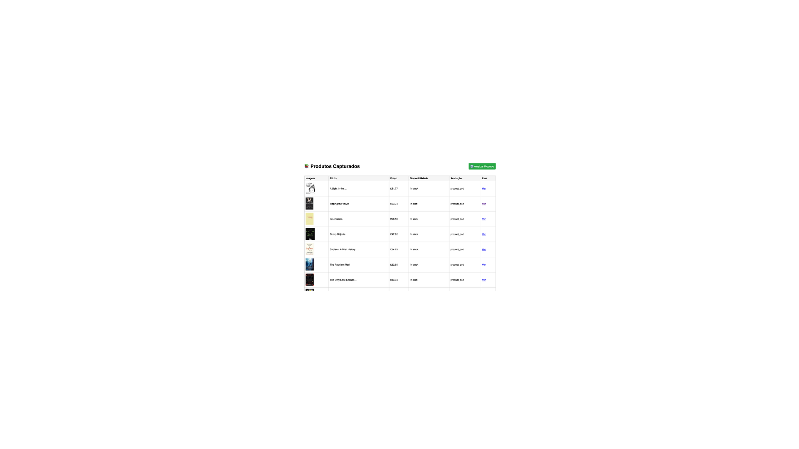
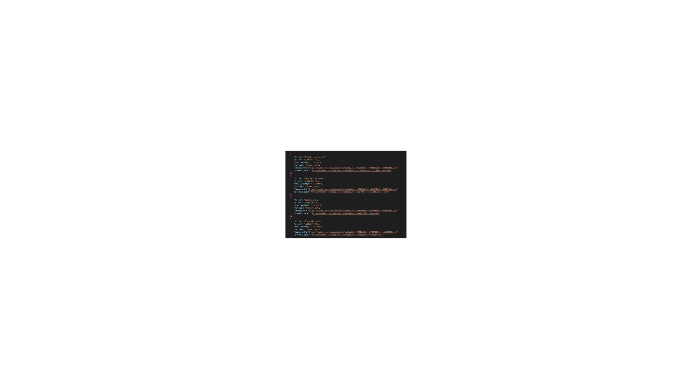

# 🛍️ Ecommerce Scraper com FastAPI + Selenium

Este é um projeto de automação para raspagem de dados de produtos de um site de e-commerce fictício ([books.toscrape.com](https://books.toscrape.com)).

Utiliza:
- **Python**
- **Selenium**
- **FastAPI**
- **SQLite**
- **Jinja2 (Interface HTML)**

## 🚀 Funcionalidades

✅ Raspagem de produtos com:
- Título
- Preço
- Disponibilidade
- Avaliação (rating)
- Imagem
- Link do produto

✅ Armazenamento em:
- Banco de dados SQLite
- Arquivo CSV
- Arquivo JSON

✅ Interface Web com:
- Listagem de produtos
- Botão para atualizar os dados com um clique

## 🧪 Como usar

1. Instale as dependências:
```bash
pip install -r requirements.txt
```

2. Rode a API com interface:
```bash
uvicorn main:app --reload
```

3. Acesse no navegador:
- [http://localhost:8000](http://localhost:8000) — Interface HTML
- `/scrape-html` — Atualiza os produtos
- `/products` — Lista JSON
- `/scrape` — Executa scraping via JSON

## ⚠️ Aviso sobre a pasta `data`

Os arquivos da pasta `data` (`products.db`, `products.csv`, `products.json`) **não estão presentes no repositório** por padrão, mas serão criados automaticamente após a primeira execução do scraper.

## 🗂️ Estrutura do Projeto

```
ecommerce_scraper/
├── main.py          # Inicia a FastAPI e rotas
├── scraper.py       # Raspagem com Selenium
├── models.py        # Banco de dados SQLite
├── utils.py         # Exportação CSV/JSON
├── requirements.txt # Dependências
├── templates/
│   └── index.html   # Interface HTML com Jinja2
├── data/
│   ├── products.db  # Banco local
│   ├── products.csv
│   └── products.json
└── README.MD
```

## 📸 Screenshots




## 📦 Requisitos

- Python 3.8+
- Google Chrome + chromedriver (instalado e no PATH)

## 💡 Créditos

Site para scraping: Books to Scrape — gratuito para testes educacionais.

---
Desenvolvido por Antonio - 2025
